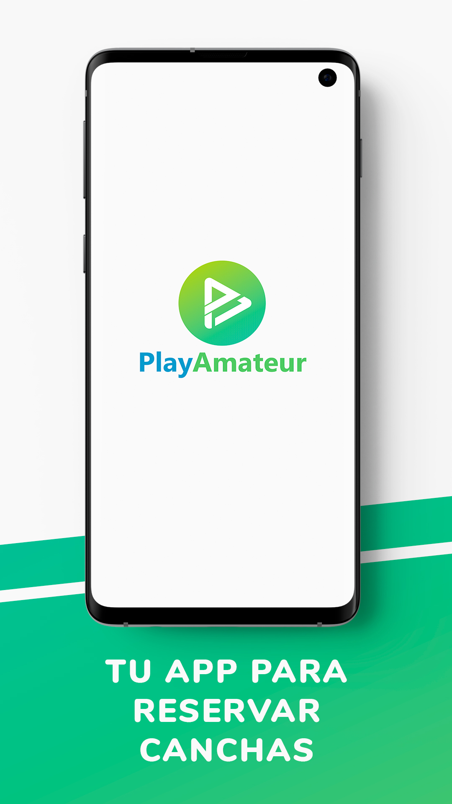
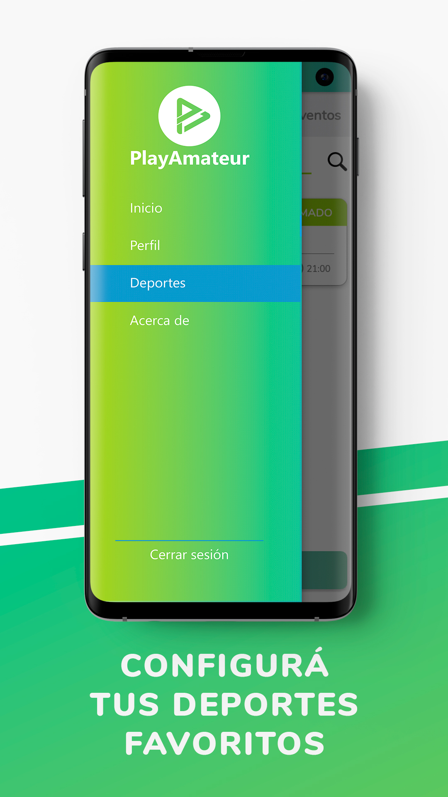
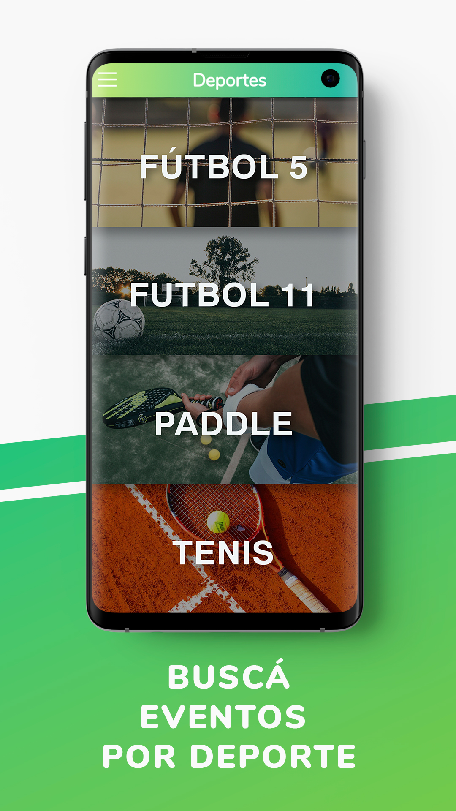
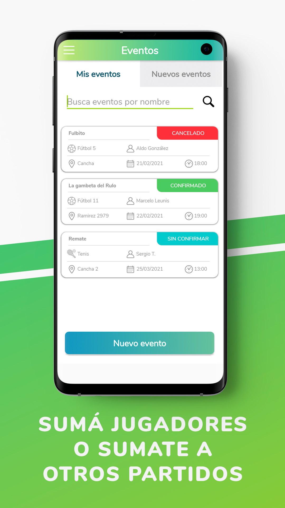
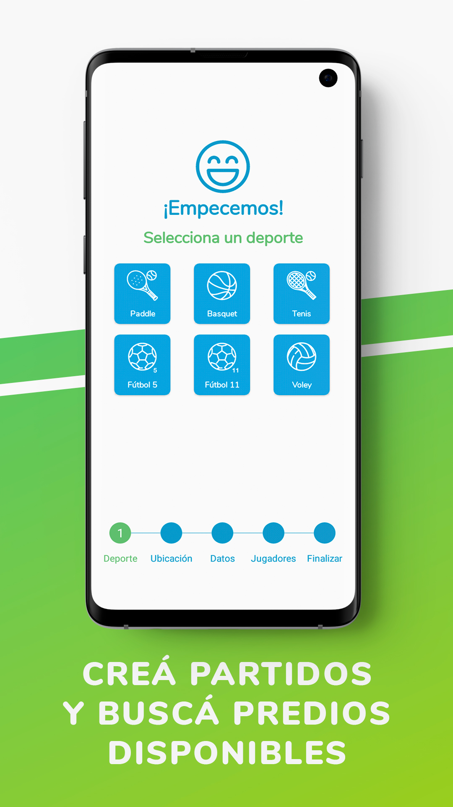
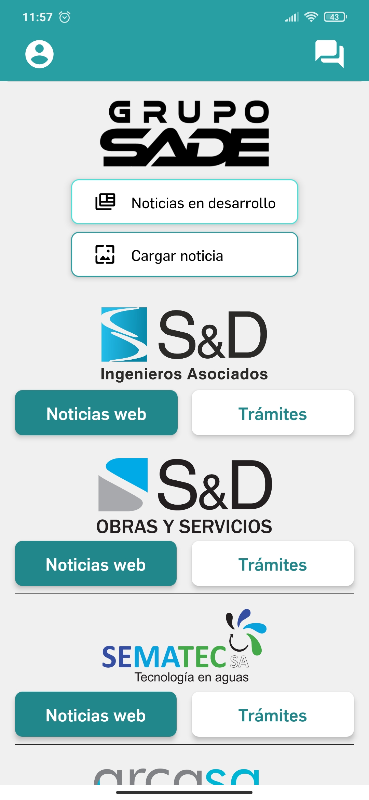
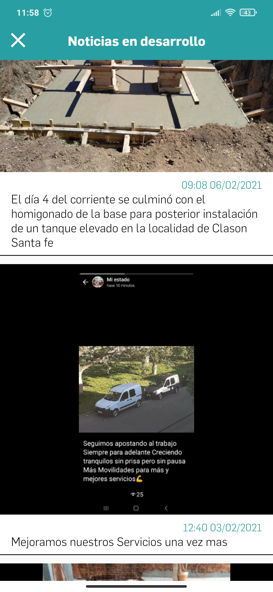
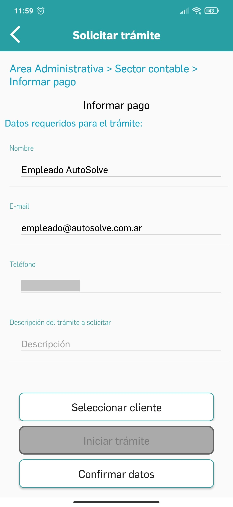
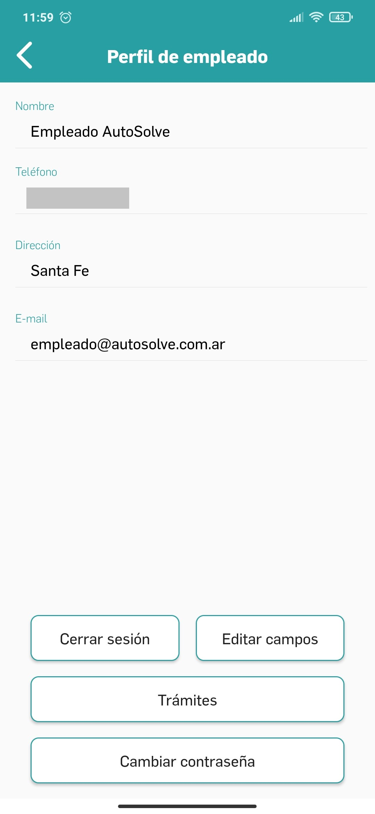
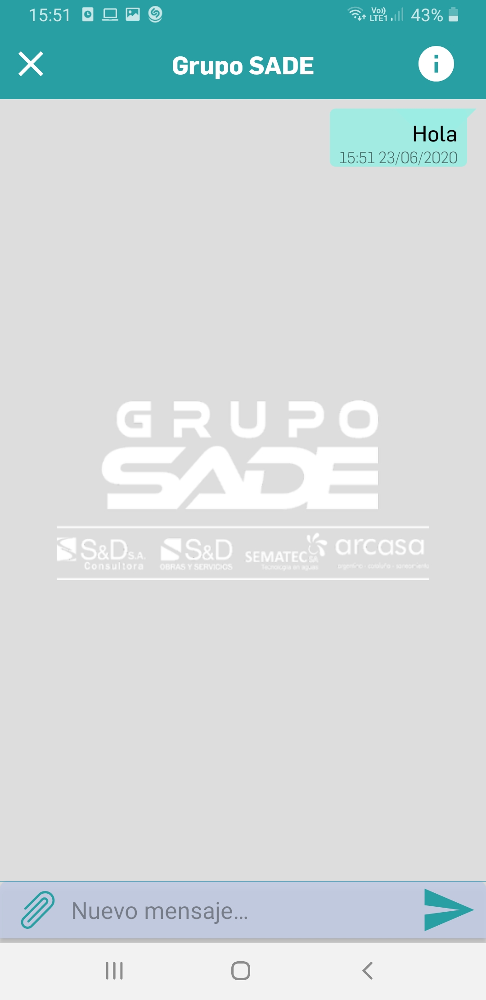

<h1 style="text-align: center">
Portfolio: Facundo Jatón - Android Developer
</h1>

 

I'm a software developer specialized in Android Apps with Kotlin and I have also developed websites associated with
them. I have a background in electronics studies too, but after my first automation, electronics and software
development projects, I realized that my passion was in writing high-quality code and making my contribution through
apps that solve specific problems, apply the newest technologies and make people's lives easier.

## Experience

Working on [AutoSolve](https://www.autosolve.com.ar/#/), which is my own Startup, since 2018. Developed over 10 Android
Apps, all of them in Kotlin and 4 Websites with Vue.js and Quasar. Backends with Firebase

<h2 style="text-align: center"> Apps </h2>
<h3> Play Amateur </h3>

Android App that works as a social network and organizer of amateur sports matches. Inside, the app has features for
players and Sports facilities owners. Also include an Admin website for the customer.  
**Features**: Firebase integration (Authentication, Realtime and Cloud Firestore Database, Cloud Functions with node.js
and Firestore). Login with Email, Google and Facebook, User Profile with picture (Glide), Push notifications, Chat (1 on
1 and GroupChats). MVP Pattern implemented.

<h3> Grupo SADE </h3>

App made for an Engineering Consulting Company. It’s a communication network between employees and clients and also
issue tracker of Civil and Hydraulic Engineering projects. It presents different features for clients and for employees
of the company.  
**Features**: Firebase integration (Authentication, Firestore, Realtime and Cloud Firestore Database, Cloud Functions
with node.js). Login with Email, User Profile editable, Push notifications, Chat, Files and Pictures transactions
between users, webviews with customer webpages, issue tracker with updates and completion percentage, Instagram-like
wall. MVP Pattern implemented.

<h3> CaSCADA </h3>

Alarm and status notifier for water treatment and distribution plants. It has a PLC-based control, automation and
monitoring system in the workplace, connected to the App through Firebase.  
**Features**: Integration with Firebase (Authentication, Firebase Realtime Database, Cloud Functions with Node.js).
Login with email, push notifications, web views with client web pages, alarm tracking in real time. MVP Pattern
implemented

 

<h3> MecanicApp </h3>

Two apps:  
App for customers and mechanics: A Mechanical assistance service in order to provide support to its users. The same app
is provided for the end user and for the mechanic. Customers can create "incidences" when they have car problems. When
an incident is reported, the specific location of the customer is sent to the Admin app, who then assigns a mechanic.
Customer and Mechanic App: create new user, manage it, request car registration, register incidents, qualify mechanic,
access to a quick help forum and opportunity to register as a mechanic Admin app: accepting/blocking users,
registering/unregistering mechanics, see the historical log of incidents, assigning incidents to a mechanic, interacting
with the customer and uploading images (advertisements and promotions).  
**Features**: Firebase integration (Authentication, Realtime and Cloud Firestore Database, Cloud Functions with node.js
and Firestore). Login with Email and Google, specific navigation by user-type, User Profile with picture
(Glide), Push notifications, Google Maps and Location, Chat (1 on 1 and GroupChats), Lottie animations. MVP Pattern
implemented.  

Customers & Mechanics app  

<h3> BeerTrack </h3>

Beer Track is an app designed for the management of kegs in the manufacture and distribution of beer. Allows the users
to create, update and delete kegs from the system, as well as rent them to their clients and keep the track of every
keg's state. Every item can be identified with a number, and a QR Code.  
**Features**: Firebase integration (Authentication, Firestore, Realtime and Cloud Firestore Database, Cloud Functions
with node.js). Login with Email, CRUD of kegs, realtime monitoring of the status of each item in stock, User Profile
editable, generate and read QR codes with ZXing and QRCodeScanner, brewery's customer register. MVP Pattern implemented.

<!--  -->

<h3> Corporate Logging control </h3>

Works as a logging service for a big company, it registers the company's employees as they enter and leave the
workplace. The employee has to take a selfie in the workplace and upload it trough the app. Through GPS data, the
company will know where and when the employee was. With the help of the website, the company can keep track of how much
each employee has worked and how they clocked in and out.  
**Features**: Android app and Web with Vue.js and Quasar. Firebase integration (Authentication, Firestore, Realtime and
Cloud Firestore Database, Cloud Functions with node.js). Login with Email, Google Maps and Location, Picture taking and
uploading, Glide library, offline and online detection, Room, Shared Preferences, Material design and Lottie animations.
MVP Pattern implemented.

<!--  -->

<h3> RestaurantApp </h3>

Integrated multi-platform system for a restaurant: Android application (for waiters) and two websites (kitchen and cash
desk). Through the app, the waiters can create meal and drink orders, searching and selecting them in a menu
(editable from the cash website). When the order is complete, the cook will let the waiter know by push notifications
system.  
**Features**: Firebase integration (Authentication, Realtime Database, Cloud Functions with node.js). Login with Email,
Push notifications, order tracker with updates and completion states. MVP Pattern implemented.

<!--  -->

